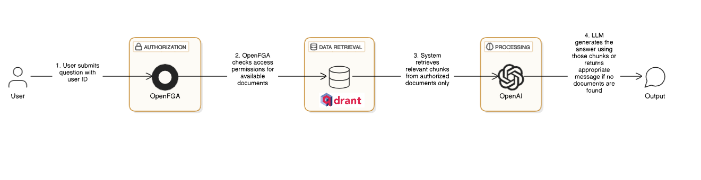
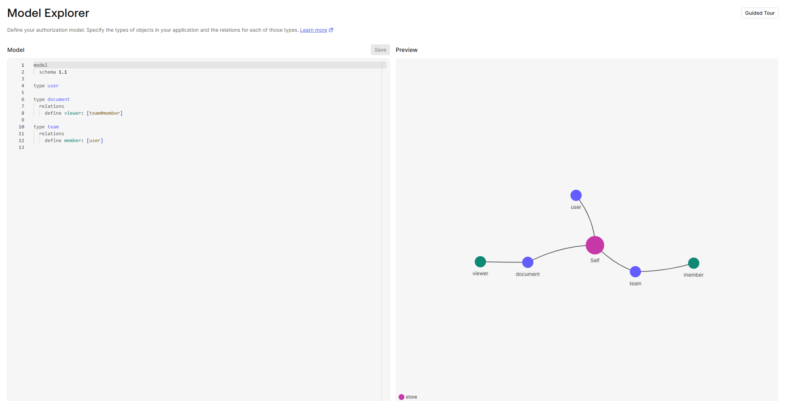
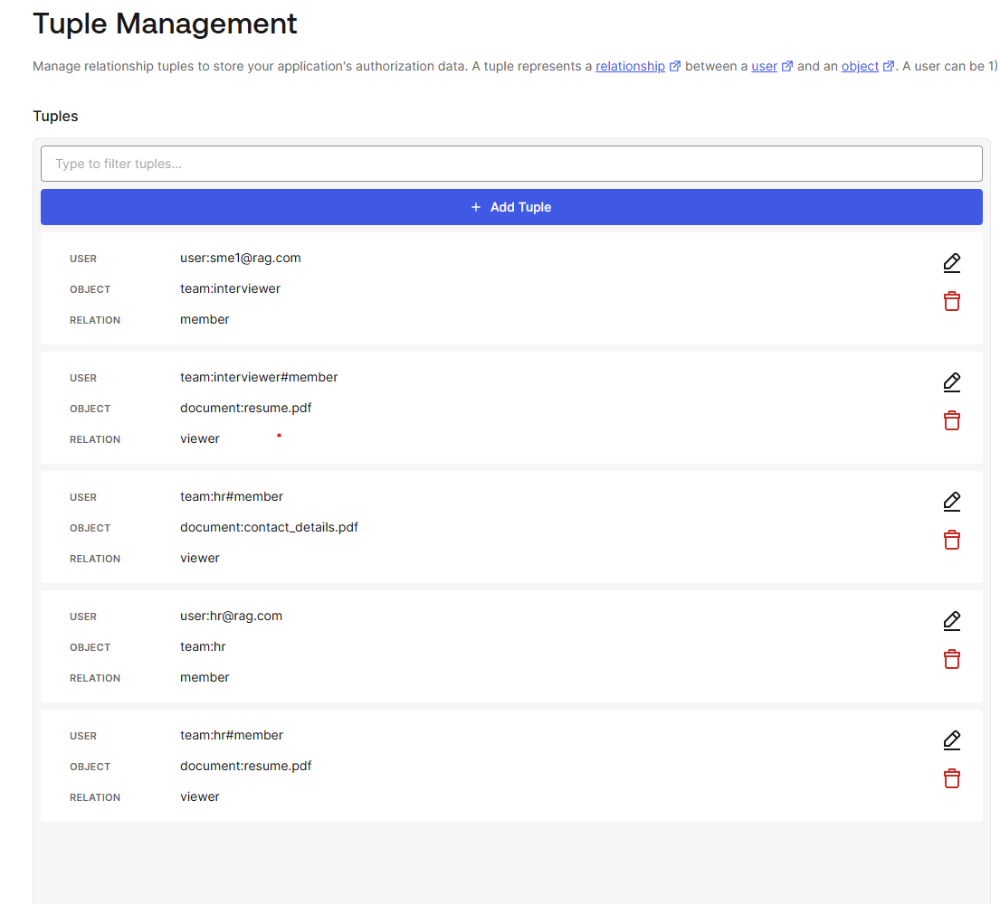

# RAG with OpenFGA Access Control

This implementation combines Retrieval Augmented Generation (RAG) with OpenFGA's fine-grained authorization to create a secure document question-answering system with granular access control.

## Overview

The system allows users to query documents while enforcing document-level access permissions. It uses:
- OpenFGA for fine-grained access control
- Qdrant for vector storage
- LangChain/LangGraph for RAG implementation
- GPT-4 for answer generation

### Key Features

- Document-level access control
- Permission-aware document retrieval
- Secure question answering
- PDF document support
- Configurable chunking and embedding





## Setup

1. Install dependencies:

```bash
pip install -r requirements.txt
```

2. Set up environment variables in `.env`:

```env:frameworks/open-fga/README.md
OPENAI_API_KEY=your_openai_key
QDRANT_URL=your_qdrant_url
QDRANT_API_KEY=your_qdrant_api_key
QDRANT_COLLECTION=your_collection_name
OPENFGA_API_URL=your_openfga_api_url
OPENFGA_STORE_ID=your_store_id
```

3. Create an OpenFGA store and authorization model:
```bash
curl -X POST ${OPENFGA_API_URL}/stores \
  -H "Content-Type: application/json" \
  -d '{"name":"document_store"}'
```

4. Define your authorization model:
```json
{
  "type_definitions": [
    {
      "type": "document",
      "relations": {
        "viewer": {
          "this": {}
        }
      }
    },
    {
      "type": "user",
      "relations": {}
    }
  ]
}
```

## Usage

1. Place your PDF documents in the `knowledge` folder.

2. Run the RAG system:
```bash
python build_rag_with_fga.py
```

3. Available commands:
- `recreate`: Rebuild the document index
- `display`: Show the RAG pipeline graph
- `invoke`: Ask questions (requires user ID)
- `check_access`: Check document access permissions
- `exit`: Exit the program

### Example Usage

```bash
Enter the action to perform: invoke
Enter the user ID: user123
Enter the question to ask: What are the key points in document1.pdf?
```

## Access Control

The system uses OpenFGA to manage document access:
- Each document has a unique identifier
- Users are assigned viewer permissions per document
- The FGARetriever enforces permissions during retrieval
- Only authorized documents are used for answering questions

### Adding Permissions

Use the OpenFGA API to grant access:
```bash
curl -X POST ${OPENFGA_API_URL}/stores/${STORE_ID}/write \
  -H "Content-Type: application/json" \
  -d '{
    "writes": {
      "tuple_keys": [
        {
          "user": "user:user123",
          "relation": "viewer",
          "object": "document:doc1.pdf"
        }
      ]
    }
  }'
```

## Architecture

The system follows this flow:
1. User submits a question with their user ID
2. OpenFGA checks access permissions for available documents
3. System retrieves relevant chunks from authorized documents only
4. If relevant documents are found, LLM generates the answer using those chunks
5. If no authorized documents are found or relevant, appropriate message is returned

## Error Handling

The system includes comprehensive error handling:
- Logging to daily log files
- Custom RAGError exception class
- Graceful failure handling
- Detailed error messages

